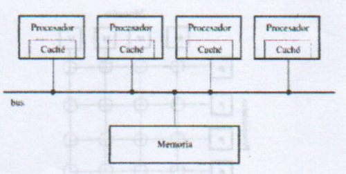

# SISTEMAS DISTRIBUIDOS

### Introducción a los S.O. Distribuidos

Antes las compus resultaban caras e independientes debido a su sistema **centralizado**. En 1980 surgieron dos avances tecnológicos: el desarrollo de MICROPROCESADORES y la invención de las REDES (wan y lan) lo que llevó a la implementación de los Sist. Operativos Distribuidos (SOD)
La definición de SOD contempla los aspectos del hardware y software. Un SOD es una colección de computadoras independientes que aparecen ante los usuarios del sistema como una unica computadora.

### Ventajas e inconvenientes de los sist. distribuidos

Una de las principales ventajas de los sist. distrib. es el bajo coste que tienen los microprocesadores hoy en dia y que permiten el diseño de una computadora con tantos microprocesadores como se necesiten y que en ocaciones no se podria contar con un único procesador que equivalga al conjunto. Es por eso importante considerar que en los sistemas distribuidos hay grandes ventajas en la realizacion de cálculos matematicos. permitiendo tener asi un mejor rendimiento y una gran variedad de aplicaciones que son inherentemente distribuidas.

Otro motivo por el cual es conveniente un Sist distribuidoes su **mayor fiabilidad**, puesto que un fallo en un procesador afectará como mucho a una maquina pero el resto podría seguir funcionando.
Si todo dependiece de una sola comp. , el fallo de esta provocaría el colapso de todo el sistema.
Por ultimo, cabe destacar la posibilidad que en los sistemas distribuidos se puede experimentar un crecimiento incremental, segun las necesidades de ampliacion que se vallan producioendo en el futuro. Si solo se dispone de una gran computadora (sistema centralizado) y llegara el momento que en la empresa la computadora ya no es la adecuada, la solucion será  remplazarlo por uno mas grande o añadir una segunda computadora. Con un sist. distrib. se van añadiendo nuevas computadoras según la necesidad, es decir, un crecimiento por incrementos (desarrollo gradual conforme a necesidades) o escabilidad.

Otras ventajas en resumidas palabras son: 
- Compartición de la información sin preocuparse por la distribucion física(todo con respecto a los sist. centraliz.)
- Comparticion de datos perifericos
- mejor comunicacion
- mayor flexibilidad (respecto a las computadoras individuales) 

Sin embargo, **los sistemas distribuidos también tienen sus desventajas, entre ellas hay que destacar la del software.**Que todavia no esta muy desarrollado. Las inherentes a las redes de comunicacion. las posibles perdidas de informacion en la transmision y el grave problema de la seguridad.
Tambien hay que tener en cuenta que si el sist crece la red puede llegar a asaturars, teniendose que ampliar o cambiar el soporte fisico de transmision. El problema de la seguridad se vuelve crucial, ya que la posibilidad de comparticion de los datos tambien permite que personas que en un principio no están autorizadas puedan acceder a los mismos.

### Conceptos de Hardware
**Taxonomia de Flynn:** Está basada en un flujo de instrucciones I y datos D (Simple S, Multiple M)
- SISD (pc, antiguos mainframe),
- MISD (situaciones de paralelismo redundante, por ej sist de navegacion aerea, donde se necesitan sist de respaldo ante la falla de uno)
- SIMD (sistemas paralelos como por ej un procesador vectorial)
- MIMD >> SOD

Otra dimensión de la taxonomia es que, en ciertos sistemas, las maquinas estan fuertemente acopladas y en otras estan debilmente acopladas. En un sist. fuertemenete acoplado, el retraso que se experimenta al enviar un mensaje de una computadora a otra es corto y la tasa de transmision de los datos, es decir, el nro de bits por seg. que se puede tranferir, es alta. En un sistema debilmente acoplado ocurre lo contrario: el retraso de los mensajes entre maquinas es grande y la tas de transmision de los datos es baja. Los sistemas fuertemente acoplados tienden a utilizarse como sistemas distribuidos aunque no siempre es cierto.

### Hardware de los multiprocesadores

Los multiprocesadores se pueden aplicar para aumentar la productividad del sistema, al poder ejecutarse diferentes procesos de un usuario sobre algunos procesadores en paralelo y para ganar velocidad en la aplicación. Existen diversos conceptos del hardware correspondiente a los sistemas distribuidos, entre los q se incluyen:
1. Multiprocesadores con bus compartido
2. Sistemas conectados mediante barras cruzadas
3. Sistemas conectados mediante una red de conmutación multitapa
4. Conexiones hipercubo

La importancia de la forma de conexion radica en la influencia dominante que tiene sobre el ancho de banda y la saturacion de la comunicacion en el sistema. A continuacion se resumira brevemente las formas de conexion indicadas y la capacidad de cada una de las arquitecturas de expandirse para soportar un mayor numero de procesadores. (escalabilidad)

#### Multiprocesadores con bus compartido

Una de las formas mas sencillas de contruir un sistema **multiprocesador** es usar un bus compartido para conectar los procesadores y la memoria, tal como se esquematiza en la siguiente figura:

Los multiprocesadores con base en buses constan de cierta cantidad de CPU, conectados a un bus común, junto con un módulo de memoria. Una configuración sencilla consta de un plano de base de alta velocidad o tarjeta madre, en el cual se pueden insertar las tarjetas de memoria y el CPU. Un bus típico tiene 32 0 64 líneas de direcciones, 32 o 64 líneas de datos y 32 o más líneas de control, todo lo cual opera en paralelo.

Para que un procesador lea una palabra de la memoria debe colocar la dirección de la palabra deseada en las lineas de dirección del bus y activar la señal de lectura en la línea de control adecuada.
La memoria responde situando el contenido de la palabra en las líneas de datos. Similar con la escritura.

Si un procesador escribe una palabra sobre la memoria y otro lee esa palabra, el último procesador obtendrá el valor escrito previamente por el primer procesador. Sin embargo, el problema es que el bus se puede saturar. Una posible solución es disponer de alguna forma de **memoria caché**:

- Ya sea asociandola con la memoria compartida, en esté caso los procesadores acceden a ella por el bus

- O asignar a cada procesador una caché, tal como se muestra en la Figura de arriba. La cache almacena todas las palabras a las que se han ingresado y todas las solicitudes pasan por la cache. Sí una palabra solicitada ya está en ella, esta responde al procesador y no se hace uso del bus.

La existencia de múltiples cachés presentan problemas de coherencia de la información almacenada en ellas: Para mantener esta coherencia se utilizan protocolos especializados y hardware adicional como
los “espías” 6 monitores de cachés, que observan el bus y cuando se hace una petición de escritura en una dirección presente en la caché se actualiza con el nuevo valor.

La escalabilidad de este esquema está limitada por el bus y la memoria compartida. En implementaciones comerciales se soportan del orden de 10 procesadores. Es un esquema sencillo, por lo que muchos diseños están basados en bus compartido.

#### Multicomputadoras con base en buses

Por otro lado, la contrucción de una multicomputadora es facil. Cada CPU tiene conexion directa con su propia memoria local. El unico problema restante es la forma en que los CPUs se comunicaran entre sí. Es claro que tambien se necesita cierto esquema de interconexion, pero como solo es para la comunicacion entre un CPU y otro, el volumen del trafico será de varios ordenes menor en relacion con el uso de una red de interconexion para el tráfico CPU-mem.

#### Sistemas conectados mediante barras cruzadas

