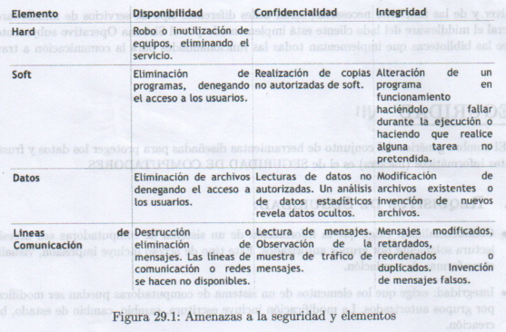

# Seguridad
El nombre genérico del conjunto de herramientas que se usa para proteger los datos y frustrar a los piratas informaticos (hackers) recibe el nombre de **SEGURIDAD DE COMPUTADORES**

### Requisitos de Seguridad:
- Confidencialidad: Exige que la info de un sistema de computadoras sea accesible para lectura solamente por grupos autorizados. Este tipo de acceso incluye impresión, visualizacion y otras formas de revelación.
- Integridad: Exige que los elementos de un sistema de computadoras puedan ser modificados solo por grupos autorizados. La modificación incluye escritura, cambio, cambio de estado, borrado y creación.
- Disponibilidad: Exige que los elementos de un sistema de computadoras esten disponibles a grupos autorizados.

#### Tipos de amenazas
- Interrupción: Se destruye un elemento del sistema, se hace inasequible o inútil -> Amenaza a la disponibilidad
- Intercepción: Una parte no autorizada consigue acceder a un elemento -> amenaza la confidencialidad
- Alteración: Una parte no autorizada no solo consigue acceder, sino que falsifica un elemento. -> Amenaza la integridad.
- Intervención: Una parte no autorizada inserta objetos falsos en el sistema. -> Amenaza la integridad

Las amenzas pasivas son del género de las escuchas a escondidas o supervisión de las transmisiones de una organización. El objetivo del agresor es obtener la información que se esté transmitiendo. Estas amenazas son de dos tipos: Divulgación del contenido de los mensajes y análisis de tráfico. Las amenazas activas suponen alteracón del flujo de datos o la creación de flujo falso.
Se dividen en 3 categorias: 
1. Alteración del flujo de mensajes (se modifica una porción del lenguaje legítimo)
2. Privación del servicio (prohibe o inhibe el uso normal del servicio) 
3. Suplantación (Una entidad finge ser otra diferente)
   
**Un SO puede ofrecer protección (surge como necesidad ante la compartición de recursos en un entorno multiprogramado) de tipo:**

- Ninguna protección
- Aislamiento: Cada proceso opera separadamente de los demas, sin compartición ni comunicación.
- Compartir todo o nada: El propietario declara publicidad o privacidad del objeto.
- Compartir por limitación del acceso: Se comprueba la licencia de acceso de los usuarios.
- Compartir por capacidades dinámicas: creación dinámica de derechos de compartición
- Uso limitado de un objeto (por ej se puede permitir a un usuario ver un documento pero no imprimirlo)

### Intrusos (hacker o cracker):

Su objetivo es obtener acceso a un sistema o aumentar el conjunto de privilegios accesibles en un sistema. Requiere que el intruso obtenga información que debería estar protegida, que en la mayoria de los casos, esta en forma de contraseña. Un sistema debe mantener un archivo que asocia una contraseña a cada usuario y puede protegerse de dos maneras:
- Cifrado unidireccional
- Control de acceso

#### Protección de contraseñas:
La contrasela sirva para autentificar el ID del individuo que se conecta al sistema, a su vez el ID determina:
- Si el ususario esta autorizado para obtener acceso al sistema
- los privilegios convenidos con el usuario

### Estrategias de elección de contraseñas 

- formación del usuario
- generadas por la computadora
- inspección reactiva (el SO ejecuta periódicamente un averiguador de contraseñas para encontrar las que sean adivinables)
- inspección reactiva (el user elige si pass y el SO comprueba si es permisible)
  
### Enfoque para la detección de INSTRUSIONES

1. Deteccion de anomalías estadísticas
   1. Detección de nivel crítico: Supone la definicion de umbrales, independientes del usuario, para la frecuencia de aparicion de diversos sucesos.
   2. Detección basada en perfiles: Construcción del perfil de actividad de cada usuario.
2. Detección basada en reglas
   1. Detección de anomalías: reglas para detectar desviaciones con respecto a pautas de uso.
   2. Identificación de penetraciones: Método de un sistema experto que persigue comportamientos sospechosos.
   
Los métodos estadisticos intentan definir un comportamiento normal o esperado, mientras que los basados en reglas, intentan definir un comportamiento correcto.

### Virus y amenazas afines.

#### Trampillas: 
punto de entrada secreto y no documentado a un porgrama, empleado para otorgar el acceso fuera de los métodos usuales de autentificacion.

#### Bomba lógica
Lógica incrustada en un programa que se comprueba cuando se presenta un cierto conjunto de condiciones en el sistema (por ej presencia o ausencia de ciertos archivos , un dia concreto en la semana, una fecha, un usuario particular que ejecute la aplicacion), cuando se juntan dichas condiciones , ejecutará alguna función que provee a acciones no autorizadas.

#### Caballo de troya:
Rutina secreta y no documentada incrustada en un programa util de usuario. La ejecución del programa origina la ejecución de dicha rutina. Puede usarse para obtener acceso a los archivos de otro usuario en un sistema compartido o simplemente para la destruccion de datos.

#### Virus
Código genético (ADN o ARN) incrustado en un programa que hace que se inserte una copia de sí mismo en uno o más programas. Además de la propagación el virus puede realizar alguna funcion no deseada.

#### Gusano
Programa que al estar activo en un sistema puede comportarse como un virus o bacteria, o bien puede implantar caballos de troya. Para reproducirse, un gusano de red utiliza algun tipo de vehiculo en la red, por ej: servicio de correo electrónico, posibilidad de *ejecución* remota o posibilidad de *conexion* remota. La nueva copia del gusano se ejecuta en el sistema remoto donde además de las funciones que realiza, continúa propagandose.

#### Bacteria
Programa que consume recursos del sistema reproduciendose exponencialmente a sí mismo hasta agotar toda la capacidad del procesador, memoria o espacio en disco, privando a los usuarios del acceso a dicho recurso.

### Etapas de vida de un VIRUS:

1. Fase latente: Está inactivo
2. Fase de propagación: situa una copia de el en otro programa
3. Fase de activacion.
4. Fase de ejecicion
   
### Tipos de virus:
- Parásitos: Se engancha a archivos ejecutables y se reproduce al ejecutar el programa infectado.
- Residentes en memoria: se alojan en la memoria ppal como parte de un programa e infecta a todos los programas que se ejecutan.
- Del sector de arranque: infecta el sector de arranque y se propaga cuando el sistema se arranca desde el disco que contiene el virus.

### Metodos antivirus: generación de soft antivirus

- Primera generación: rastreadores simples limitados a la deteccion de virus conocidos.
- Segunda generación: rastreadores heurísticos busca infecciones probables por virus, descifra el virus para identificarlo, elimina la infección y pone el programa en servicio nuevamente.
- Tercera generación: Trampas de actividad identifican al virus por sus acciones mas que por la estructura del programa infectado.
- Cuarta generación: Protección completa paquetes con una variedad de tecnicas antivirusutilizadas en conjunto, como componentes de rastreo, trampas de actividad y control de acceso.
  
## Sistemas de confianza

Proporcionan un medio regular de acceso a los datos en funcion de quien esta autorizado a qué. El punto clave es que se diseñó e implementó de forma que los usuarios puedan tener completa confianza de que el sistema aplicará una política de seguridad determinada.

## Seguridad en Redes

Introduce nuevas cuestiones como el cifrado, la herramienta automática mas importante para seguridad en redes y comunicaciones. Es un proceso que oculta los significados cambiando mensajes inteligibles por ininteligibles. La mayoria de los equipos de cifrados disponibles comericalmente emplean cifrado convencional, donde las dos partes comparten una unica clave de cifrado y descifrado. La alternativa es un esquema de cifrado de clave pública, en el que entran en juego dos claves, una para cifrar y otra para descifrar.

